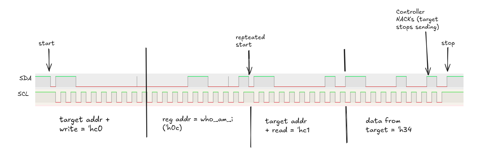
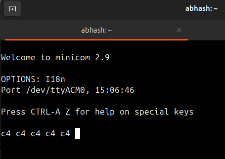

## I2C master for FPGA designs.

I2C master implementation for 100 KHz speed.

The top file acts as a reference for communicating with a target I2C device (MPL3115-A2) using
the controller I2C IP. We read the `who_am_i` register and send it over the UART every 2 seconds.

The `uart_tx` module used in the top file can be found at:
- https://github.com/AbhashPL/mini-uart/blob/main/uart_tx.v

A self-checking testbench is also provided which has tests for both reads and writes.
- `i2c_slave.v` is the simulation model for the i2c target that is used with the testbench.

### Testing

Synthesized and tested using Xilinx ISE P.20131013.

Tested on:
- xc6slx9 (Xilinx Spartan 6) FPGA on the MimasV2 board with MPL3115-A2 I2C slave.
- Reading the `who_am_i` register correctly returns 'hC4 (as referenced by the datasheet).
- The waveforms captured via logic analyzer are attached in the "Images" section.

### Images

I2C Read transaction :

Response printed on uart terminal every second :

### Next Steps:
- [ ] Multi-byte read support
- [ ] AXI/AXI-L based interface.

